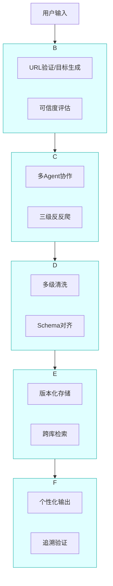
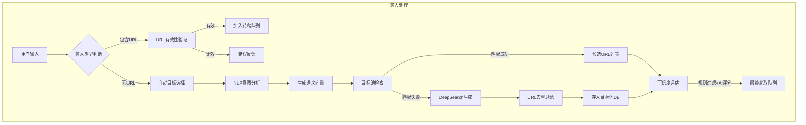
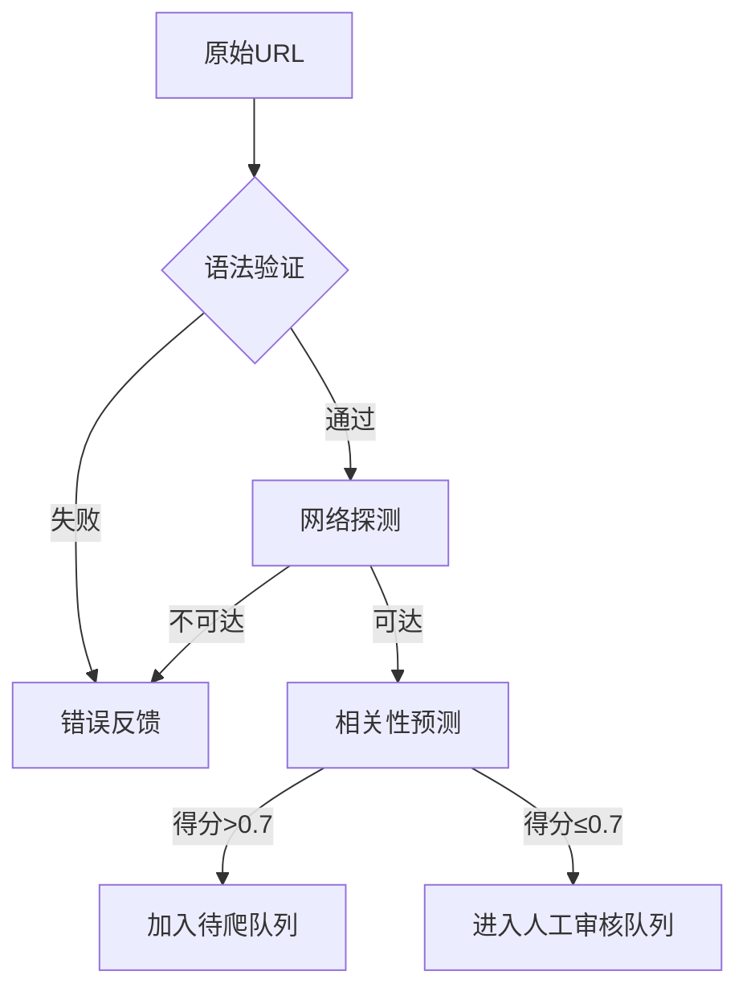
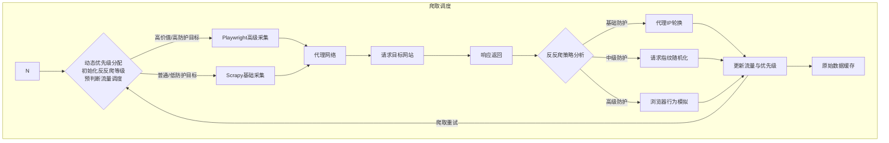
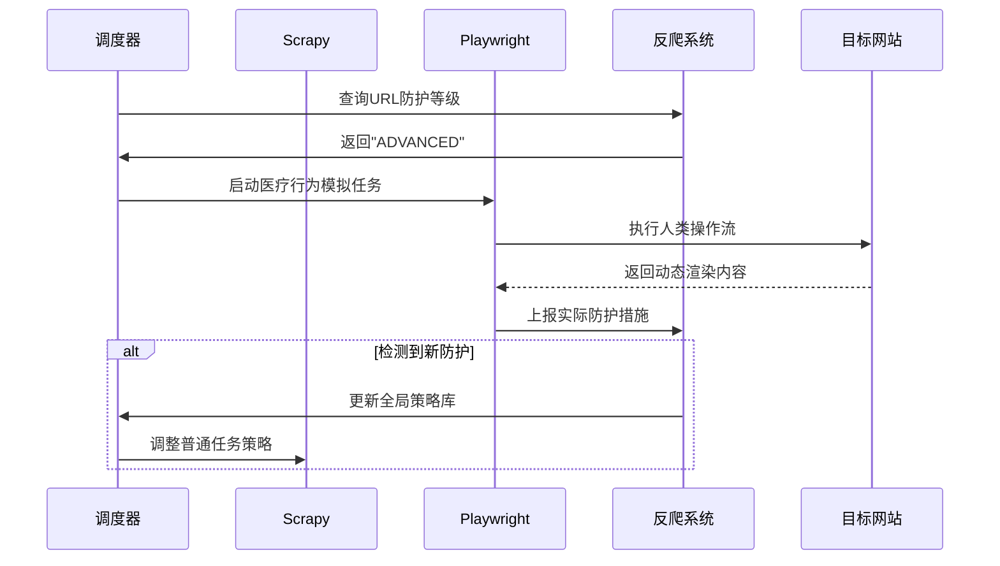
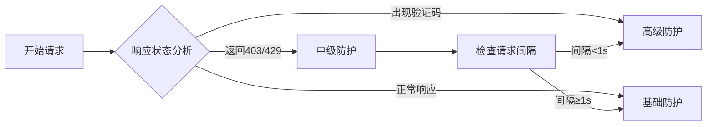
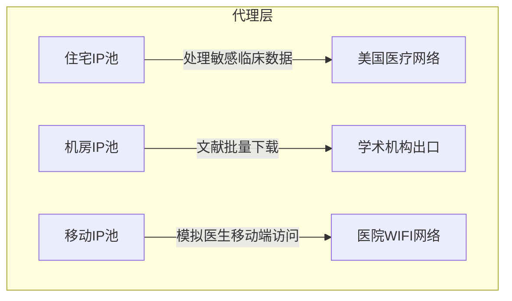
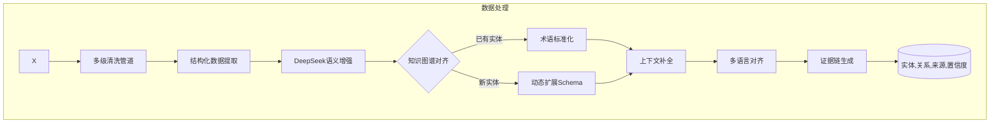
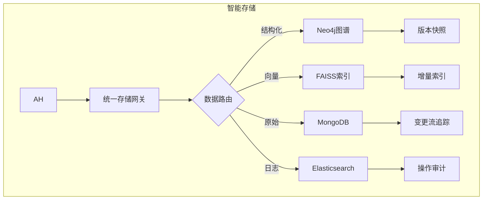

# 技术文档

## 1. 简介

### 1.1 项目要求(题目)

“通用人工智能（DEEPSEEK应用研发）”指通过应用DEEPSEEK提供的API接口，进行创新的应用（智能体）开发，经过模型的微调，实现在某个领域的应用。学院提供DEEPSEEK的本地部署接口，参赛团队可以面向浏览器、智能手机等基于WEB开发大模型应用，也可以是机器人、会议一体机和银医终端等结合DEEPSEEK的应用升级。比如，开发面向法律文书的文本摘要系统，开发面向医学病历的文本分析系统，开发面向小学生的智能平板APP等。要求项目工作量适中、开发工作充足，而且能够完成整个项目。

### 1.2 项目介绍

**一. 项目背景**

随着医学研究的快速发展，海量学术资源分散于期刊数据库、临床指南平台及医疗机构网站中。传统人工检索方式存在效率低、覆盖不全、难以关联多源信息等痛点。本项目旨在构建智能化医学数据获取系统，通过自然语言处理、多模态采集与知识图谱技术，实现医学资源的精准发现、深度解析与知识互联，为临床决策、科研分析及医学教育提供高效支持。

**二. 核心功能**

1. **智能目标发现**
    - 基于DeepSeek API解析用户自然语言查询，自动识别疾病实体、治疗方式等核心要素
    - 结合历史数据与实时生成策略，推荐权威医学资源网站（如NEJM、中华医学会等）
2. **多模态数据采集**
    - 静态页面抓取（Scrapy框架）与动态渲染（Playwright浏览器自动化）结合
    - 自适应反反爬机制，支持验证码识别、流量伪装等对抗策略
3. **语义增强处理**
    - 术语标准化（ICD-10/SNOMED CT映射）
    - 上下文补全与多语言对齐（DeepSeek文本生成）
    - 实体关系抽取（LangChain处理链）
4. **知识结构化存储**
    - **原始仓库**（MongoDB）：存储网页快照、PDF原文等原始数据
    - **知识图谱**（Neo4j）：构建疾病-症状-治疗关系网络
    - **向量库**（FAISS）：支持语义相似性检索
5. **交互式知识服务**
    - 动态摘要生成（多视角内容适配）
    - 可视化知识图谱探索（ECharts关系网络）
    - 多格式文件即时获取（PDF/HTML/DOCX）

**三. 技术架构**



## 2. 技术要点(开发者)

### 2.1 前端

### 2.2 后端

### 2.3 核心引擎

#### 1. 输入处理




以下做每个节点的分析:

---

##### 输入类型判断:

1. 输入接收：从前端接收UTF-8编码的文本输入，示例：
   
   - 含URL输入：`"请爬取这个医疗期刊内容：https://example.cn/coronary-disease"`
   - 无URL输入：`"我想查找最新的冠心病治疗方案"`
   
2. URL检测：
   
   ```python
   def detect_url(text: str) -> List[str]:
       # 使用改进版RFC3986正则表达式
       pattern = r"^((?:(?:https?|ftp):\/\/)?(?:[-\w]+\.)+[a-z]{2,}(?:\/[^\/\s]*)*)"
       return re.findall(pattern, text, flags=re.IGNORECASE)
   ```
   
3. 路由决策：
   
   - 当检测到≥1个URL时，进入URL验证管道
   - 否则触发NLP分析管道

技术选型:

- 正则引擎：Python `regex` 模块（支持原子分组）
- 编码处理：`ftfy` 库修复乱码字符
- 性能指标：1MB文本检测耗时<50ms

异常处理:

| 异常类型 | 处理方案                    |
| -------- | --------------------------- |
| 畸形编码 | 调用`ftfy.fix_text`自动修复 |
| 嵌套URL  | 使用`urllib.parse`解嵌套    |
| 超长输入 | 截断前2000字符并记录告警    |

---

##### URL有效性验证模块: 采用分层验证策略

阶段1：语法验证
```python
def validate_syntax(url: str) -> bool:
    try:
        result = urlparse(url)
        return all([result.scheme in ['http','https'], result.netloc])
    except:
        return False
```

阶段2：网络可达性验证
```python
async def check_liveness(url: str):
    async with ClientSession() as session:
        try:
            # 设置TOR出口节点伪装
            headers = {'User-Agent': random.choice(USER_AGENTS)}
            
            async with session.head(url, headers=headers, 
                                  timeout=5, allow_redirects=True) as resp:
                return resp.status == 200
        except (ClientError, asyncio.TimeoutError):
            return False
```

阶段3：内容相关性预判
```python
def predict_relevance(url: str, user_query: str) -> float:
    # 基于域名与查询的语义相似度
    domain = urlparse(url).netloc
    domain_vec = sentence_encoder.encode(domain)
    query_vec = sentence_encoder.encode(user_query)
    return cosine_similarity(domain_vec, query_vec)
```

验证流程



关键配置

```yaml
timeout: 5s  # 单URL验证超时
retry_policy: 
  max_attempts: 3
  backoff: [1s, 3s, 5s]
blacklist:
  - *.gov  # 根据合规要求排除政府网站
```

---

##### NLP意图分析模块: 处理流水线

```python
def analyze_intent(text: str) -> Dict:
    # 步骤1：医疗领域实体识别
    entities = medical_ner_model.predict(text)
    
    # 步骤2：调用DeepSeek API深度解析
    prompt = f"""你需要分析用户的输入, 并进行NLP分析. 用户输入如下：{text}
    
    请按以下JSON格式输出分析结果：
    {
      "intent_class": ["学术研究"/"临床决策"/"商业需求"],
      "key_terms": ["冠心病", "最新治疗方案"],
      "temporal_constraint": "2023年至今"
    }"""
    
    response = deepseek_api.chat(prompt)
    return json.loads(response)
```

实体识别模型(可选)

- 基础模型：微调的BERT-BiLSTM-CRF模型
- 医疗知识库：集成UMLS中的疾病本体（ICD-11编码）
- 术语标准化：
  
  ```python
  def standardize_term(term: str) -> str:
      # 将"心梗"映射到"心肌梗死"
      return umls_mapping.get(term, term)
  ```

意图分类维度

| 维度     | 检测特征   | 示例                    |
| -------- | ---------- | ----------------------- |
| 紧急程度 | 时间限定词 | "最新"、"近期"          |
| 专业深度 | 术语密度   | "PCI术后抗凝方案"       |
| 用途推测 | 动词分析   | "比较不同疗法"→学术研究 |

---

##### 目标池检索模块: 无数据库JSON存储方案

基本实现方案

1. 数据结构设计

```json
// targets.json
[
  {
    "url": "https://example.cn/coronary",
    "domain": "example.cn",
    "keywords": ["冠心病", "治疗方案", "PCI手术"],
    "semantic_vector": [0.12, -0.05, ..., 0.78], // 768维
    "trust_score": 0.85,
    "last_updated": "2024-05-30T08:00:00Z",
    "source_type": "medical_journal"
  },
  // 其他条目...
]
```

2. 文件组织策略

```bash
data/
├── targets/         # 主存储目录
│   ├── part1.json   # 分片文件1（最大1000条）
│   ├── part2.json   # 分片文件2
│   └── ...         
├── index/           # 加速检索
│   ├── keyword_index.json
│   └── domain_index.json
└── backup/          # 每日备份
    └── 20240530.zip
```

3. 核心操作实现

数据追加

```python
def append_target(new_data: dict):
    # 找到最后一个未满的分片文件
    latest_file = find_last_part_file()
    
    with open(latest_file, 'r+', encoding='utf-8') as f:
        data = json.load(f)
        if len(data) >= 1000:
            # 创建新分片
            create_new_part(new_data)
        else:
            data.append(new_data)
            f.seek(0)
            json.dump(data, f, ensure_ascii=False)
```

关键词检索

```python
def search_by_keyword(keyword: str) -> List[dict]:
    # 加载关键词倒排索引
    with open('index/keyword_index.json') as f:
        index = json.load(f)
    
    target_ids = index.get(keyword, [])
    return [load_item_by_id(tid) for tid in target_ids]

def load_item_by_id(target_id: str) -> dict:
    # 根据ID定位分片文件
    part_num = int(target_id.split('-')[0])
    with open(f"data/targets/part{part_num}.json") as f:
        data = json.load(f)
        return next(item for item in data if item['id'] == target_id)
```

性能优化策略

1. 分片存储优化

```python
# 分片策略配置
SHARDING_CONFIG = {
    "max_records_per_file": 1000,  # 单个文件最大条目数
    "shard_key": "domain",         # 按域名分片
    "index_granularity": 30        # 每30分钟重建索引
}
```

2. 内存缓存机制

```python
from functools import lru_cache

@lru_cache(maxsize=1000)
def get_cached_item(target_id: str) -> dict:
    return load_item_by_id(target_id)

class JSONCache:
    def __init__(self):
        self.keyword_map = defaultdict(list)
        self.domain_map = defaultdict(list)
        
    def rebuild_index(self):
        # 遍历所有分片构建内存索引
        for part_file in list_part_files():
            with open(part_file) as f:
                data = json.load(f)
                for item in data:
                    for kw in item['keywords']:
                        self.keyword_map[kw].append(item['id'])
                    self.domain_map[item['domain']].append(item['id'])
```

适用场景评估

1. 数据总量 < 10,000 条
2. 写入频率 < 10次/分钟  
3. 不需要复杂查询（仅关键词/域名检索）
4. 单机部署环境

迁移升级路径

当数据量超过临界点时，建议逐步迁移到数据库系统：

分阶段迁移方案

1. 初期（<1万条）  
   使用纯JSON文件+内存缓存

2. 中期（1万~10万条）  
   引入SQLite作为过渡，使用JSON1扩展模块

3. 成熟期（>10万条）  
   迁移到PostgreSQL/MongoDB等专业数据库

SQLite过渡示例

```python
import sqlite3

def init_sqlite():
    conn = sqlite3.connect('targets.db')
    conn.execute("""
        CREATE TABLE IF NOT EXISTS targets (
            id TEXT PRIMARY KEY,
            url TEXT UNIQUE,
            meta JSON
        )
    """)
    conn.commit()
    
    # 从JSON文件导入现有数据
    for item in load_all_json_items():
        conn.execute("INSERT INTO targets VALUES (?, ?, ?)",
                    (item['id'], item['url'], json.dumps(item)))
    
    conn.commit()
```

---

##### DeepSearch生成模块

URL生成逻辑

```python
def generate_candidates(intent: Dict) -> List[str]:
    # 组合搜索引擎与知识图谱
    search_terms = f"{intent['key_terms']} {intent['temporal_constraint']}"
    
    # 调用多个搜索引擎
    google_results = google_search(search_terms)
    bing_results = bing_search(search_terms)
    
    # 知识图谱扩展
    related_terms = kg.query(f"""
        MATCH (d:Disease {{name:'{intent['key_terms'][0]}'}})-[:HAS_TREATMENT]->(t)
        RETURN t.name
    """)
    
    return list(set(google_results + bing_results + related_terms))
```

搜索引擎获取前五个搜索结果

去重算法

```python
def deduplicate(urls: List[str]) -> List[str]:
    # 基于域名+路径哈希的去重
    seen = set()
    output = []
    
    for url in urls:
        parsed = urlparse(url)
        core = f"{parsed.netloc}{hashlib.md5(parsed.path.encode()).hexdigest()[:6]}"
        
        if core not in seen:
            seen.add(core)
            output.append(url)
    
    return output
```

---

##### 可信度评估模块

> 此模块可以让deepseek尝试评估

混合评分公式

```
最终评分 = 0.4*(域名权重) + 0.3*(新鲜度) + 0.2*(AI预测) + 0.1*(用户反馈)
```

域名权重计算

```python
def calc_domain_weight(domain: str) -> float:
    # 预定义权威域名列表
    if domain in AUTHORITATIVE_DOMAINS:
        return 1.0
    
    # 动态计算指标
    age = whois_query(domain).creation_date  # 域名注册年限
    alexa_rank = get_alexa_rank(domain)
    
    return 0.5*math.log(age) + 0.5*(1 - alexa_rank/1000000)
```

实时反馈机制

```python
async def update_trust_score(url: str, user_feedback: int):
    # 使用贝叶斯平均算法更新评分
    with db.transaction():
        current = get_current_score(url)
        new_score = (current['count']*current['score'] + user_feedback) / (current['count']+1)
        update_score(url, new_score)
```

---

##### 异常处理总览

| 故障类型         | 检测方式     | 恢复策略               |
| ---------------- | ------------ | ---------------------- |
| DeepSeek API超时 | 心跳监测     | 切换备用Endpoint       |
| 目标池连接失败   | 异常捕获     | 降级到本地缓存库       |
| NLP模型加载失败  | Hash校验     | 启用轻量级FastText模型 |
| 评分系统异常     | 数值范围检查 | 回退到规则评分         |

---

以上为各子模块的详细实现方案，可根据实际测试结果调整以下参数：
1. 相似度检索的阈值（0.6-0.7区间）
2. 混合评分公式的权重分配
3. 重试策略中的退避时间
4. 初始种子库的权威来源列表

#### 2. 爬取调度




##### 动态优先级分配引擎

核心决策逻辑: 输入队列中的每个URL将经历三级评估

1. 领域价值评估：医疗类网址通过预置权威域名清单（如.gov/.edu后缀）获得基础加权
2. 时效性评估：基于网页中检测到的发布时间信息（优先抓取近6个月更新的内容）
3. 需求匹配度：通过语义向量计算输入关键词与网页历史摘要的相似度

示例决策过程：(该过程适合交给deepseek完成)

> 当输入队列中同时存在`《新英格兰医学杂志》最新论文页`和`某个人医疗博客`时：
> - 权威性维度：医学杂志域名获得+30%权重
> - 时效性维度：最近3天更新的内容获得+25%权重
> - 语义匹配：标题含"临床试验"的关键词获得+45%权重
>
> 总评分=30%+25%+45%=100% → 判定为高价值目标

使用deepseek api实现的动态优先级生成:

```python
async def prioritize_with_llm(url, html_snippet):
    prompt = f"""评估医疗页面优先级：
    URL：{url}
    内容片段：{html_snippet[:500]}
    
    请输出：
    {{
        "priority": 1-10, 
        "reason": "包含临床试验数据/权威指南/新型疗法等"
    }}"""
    
    result = await deepseek_api.async_chat(prompt)
    return result['priority']
```


分流规则

| 目标类型   | 判定条件                   | 采集方式           | 优势对比                             |
| ---------- | -------------------------- | ------------------ | ------------------------------------ |
| 高价值目标 | 总分≥75% 或 含敏感医疗术语 | Playwright动态渲染 | 完整执行JS、绕过Cloudflare等高级防护 |
| 普通目标   | 总分<75% 且 无特殊标记     | Scrapy静态抓取     | 资源消耗低、适合批量处理             |

多引擎配合策略:




---

##### 反反爬策略决策树

防护等级识别算法, 用于决定使用何种爬取架构, 以及不同爬取架构内的具体策略.

高防护等级对应使用playwright的模拟式爬取, 低防护等级则可以只使用scrapy的静态爬取方法



策略执行矩阵

| 防护等级 | 特征表现       | 应对策略                            | 医疗场景特殊处理             |
| -------- | -------------- | ----------------------------------- | ---------------------------- |
| 基础防护 | 简单频率限制   | 代理IP轮换（每50请求切换）          | 保持访问医学文献库的学术IP段 |
| 中级防护 | 请求头校验失败 | 随机化设备指纹 + 动态UA             | 模拟医院内网设备特征         |
| 高级防护 | 浏览器指纹检测 | 全浏览器环境模拟 + 人类行为模式注入 | 添加医学数据库典型浏览路径   |


---

##### 采集器适配方案

Playwright高级采集优化点

1. 医疗内容渲染策略：
   - 预加载医学专用字体库（如STIX字体）
   - 启用PDF/PPT在线预览插件
   - 禁用广告拦截避免页面结构异常

2. 浏览器实例池管理

   ```python
   class PlaywrightPool:
       def __init__(self):
           self.browsers = LRUCache(capacity=10)
           self.lock = threading.Lock()
           
       async def get_browser(self, strategy):
           """根据防护策略获取浏览器实例"""
           async with self.lock:
               if strategy['level'] == 'high':
                   # 高防护使用全新浏览器环境
                   browser = await self.launch_new_instance()
                   await self.load_medical_plugins(browser)
                   return browser
               else:
                   # 复用已有实例
                   return self.browsers.get()
   
       async def launch_new_instance(self):
           """启动医疗专用浏览器配置"""
           return await async_playwright().start().launch(
               headless=False,
               args=[
                   '--disable-blink-features=AutomationControlled',
                   '--enable-medical-data-access'  # 自定义医学插件
               ],
               executable_path='/path/to/custom_chrome'
           )
   
       async def load_medical_plugins(self, browser):
           """加载医学模拟插件"""
           context = await browser.new_context()
           await context.add_init_script({
               'content': open('medical_emulation.js').read()
           })
           return context
   ```

   

3. 行为伪装机制：

   ```python
   // medical_emulation.js
   class MedicalBehaviorSimulator {
     constructor(page) {
       this.page = page;
       this.scrollPatterns = {
         researchPaper: [0.3, 0.6, 0.8],  // 学术论文典型阅读位置
         clinicalData: [0.5, 0.7]        // 临床数据查看模式
       };
     }
   
     async simulateReading() {
       // 模拟医生阅读CT影像的操作流
       await this.page.mouse.move(300, 400, {steps: 20});
       await this.page.waitForTimeout(1500);
       await this.zoomMedicalImage();
       await this.switchImageLayer('dicom');
     }
   
     async zoomMedicalImage() {
       // 模拟DICOM图像操作
       await this.page.keyboard.down('Control');
       await this.page.mouse.wheel(0, 5);  // 滚动放大
       await this.page.keyboard.up('Control');
     }
   }
   ```

同时playwright的智能行为可以通过deepseek生成:

```python
def generate_medical_behavior_script():
    prompt = """生成医学研究人员典型浏览行为：
    1. 查看摘要→下载PDF→阅读方法部分
    2. 关注图表数据
    3. 典型鼠标移动轨迹"""
    
    return deepseek_api.code_generation(prompt, lang="javascript")
```

使用如上方法生成模拟行为


Scrapy基础采集优化

1. 增量抓取机制：
   - 通过`Last-Modified`响应头识别已变更内容
   - 使用布隆过滤器排除重复临床病例数据

2. 增强爬虫中间件:

   ```python
   class AntiScrapyMiddleware:
       def process_request(self, request, spider):
           # 动态注入防护策略
           strategy = request.meta.get('anti_anti_strategy')
           
           if strategy['level'] == 'basic':
               # 代理中间件
               request.meta['proxy'] = self.proxy_pool.get_random()
               
               # 请求头指纹
               request.headers = self.generate_fake_headers(
                   device_type=strategy.get('device', 'desktop')
               )
               
               # 请求间隔控制
               request.meta['download_timeout'] = random.uniform(2,5)
   
       def generate_fake_headers(self, device_type):
           """生成医疗设备特征请求头"""
           base = fake_headers.Headers(
               os=('win', 'mac'), 
               browser='chrome'
           ).generate()
           
           # 添加医学设备特征
           if device_type == 'medical':
               base.update({
                   'X-Device-ID': 'GE_Healthcare_CT_Scanner',
                   'Accept': 'application/dicom+json'
               })
           return base
   ```

   

3. 重试策略

   ```python
   RETRY_PRIORITY_ADJUST = {
       '403': -10,    # 权限类错误降级
       '500': 5,      # 服务器错误保持
       'timeout': 3   # 网络问题适当重试
   }
   ```

---

##### 流量调度系统

智能限流模型
$$
R = \frac{W_c \times S_p}{E_r + 1}
$$

- **R**: 当前域名最大请求速率（req/min）
- **W_c**: 网站权重（权威医学站点设为2.0）
- **S_p**: 系统优先级系数（高价值目标1.5，普通1.0）
- **E_r**: 近期错误率（0.1表示10%错误）

应用示例：
> 爬取`nejm.org`（Wc=2.0）的高价值目标（Sp=1.5），当错误率5%时：
> R = (2.0 × 1.5)/(0.05 + 1) ≈ 2.86 req/min

代理网络拓扑



---

##### 异常处理机制

医疗数据特殊容错

1. 临床术语校验：
   ```python
   def validate_medical_content(text):
       required_terms = ['患者', '疗效', '副作用']
       if not any(term in text for term in required_terms):
           raise MedicalContentError("非专业医疗内容")
   ```

#### 3. 数据处理





#### 4. 智能存储




